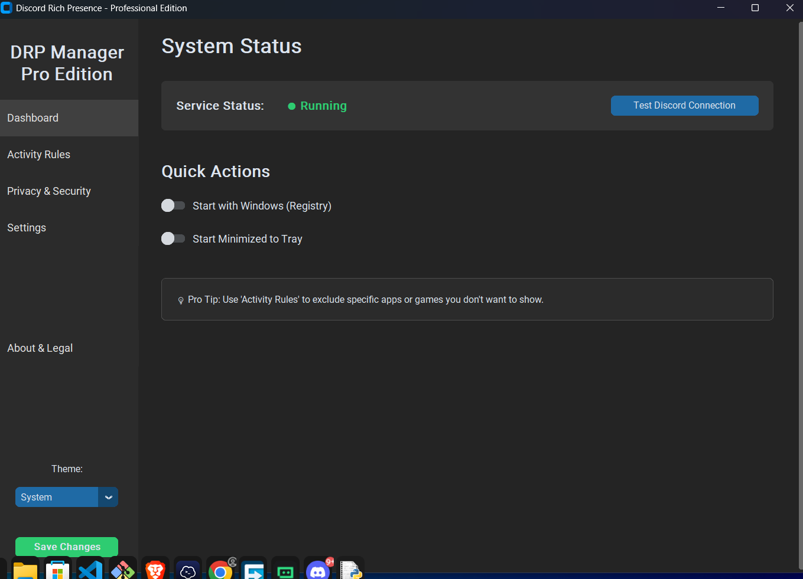
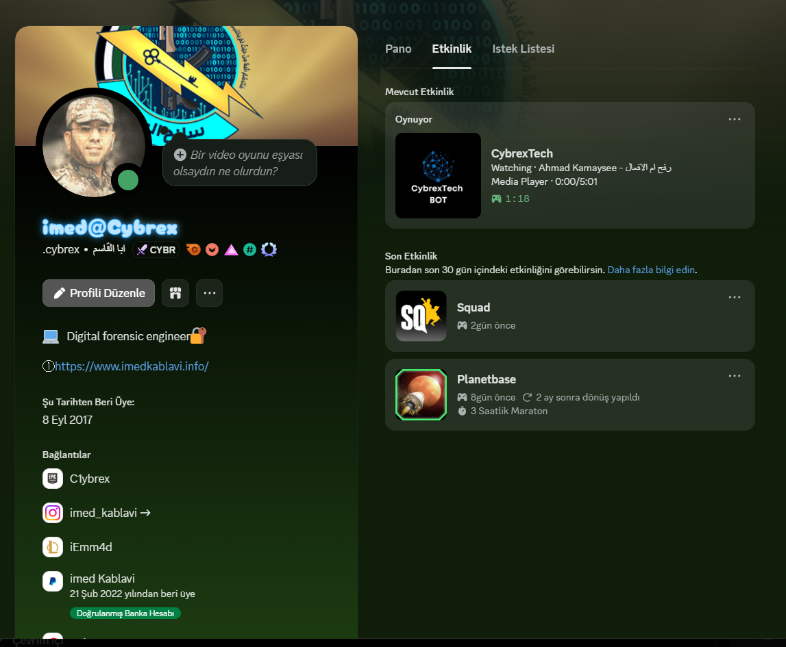

# Discord Rich Presence Service

[](https://www.python.org/downloads/)
[](https://github.com/)
[](https://opensource.org/licenses/MIT)
[]()
[](http://makeapullrequest.com)

**A professional, privacy-first background service that bridges the gap between your local activity and Discord's Rich Presence.**

---

## 🚀 Why This Project Exists

Discord's native game detection is great, but it falls short for power users, developers, and media consumers. It often fails to detect:
*   Specific code editors or the project you're working on.
*   Music playing in a web browser or local media player.
*   Terminal commands and shell activities.
*   Privacy-sensitive context that you *don't* want to share.

**Discord Rich Presence Service** solves this by running a lightweight, modular daemon that intelligently scans your active windows, processes, and media sessions to update your status with rich, accurate, and privacy-conscious details.

## 🌟 Feature Highlights

*   **Smart Context Awareness:** Distinguishes between "Watching YouTube", "Coding in Python", and "Debugging in Terminal".
*   **Zero-Cloud Privacy:** All data processing happens locally. No logs are sent to third-party servers.
*   **Auto-Redaction:** Automatically strips sensitive information (API keys, file paths, passwords) from your status.
*   **Cross-Platform:** Designed for Windows, Linux, and macOS.
*   **Extensible:** Modular detector system makes adding new apps trivial.

### 📊 Supported Detectors

| Category | Supported Applications / Services |
| :--- | :--- |
| **💻 Coding** | VS Code, Trae, JetBrains (IntelliJ, PyCharm, etc.), Sublime Text, Notepad++, Vim/Neovim |
| **🌐 Browser** | Chrome, Firefox, Edge, Brave, Opera, Vivaldi (YouTube, Netflix, SoundCloud, GitHub) |
| **🎵 Media** | Spotify (Desktop/Web), VLC, Windows Media Player, MPC-HC |
| **⌨️ Terminal** | PowerShell, CMD, Bash, Zsh (displays shell & current command) |
| **🎮 Gaming** | Automatic process detection for thousands of games |

## 🏗️ Architecture

The system follows a modular "Pipeline" architecture to ensure stability and extensibility.

```ascii
+-----------------+      +------------------+      +------------------+
|  Active Window  | ---> |   Detector API   | ---> |  Activity Object |
|    (Scanner)    |      | (Strategy Pattern)|      | (Raw Metadata)   |
+-----------------+      +------------------+      +------------------+
                                                          |
                                                          v
+-----------------+      +------------------+      +------------------+
|   Discord RPC   | <--- |  Privacy Filter  | <--- | Presence Builder |
|    (Output)     |      | (Redaction/Mode) |      | (Format & Icon)  |
+-----------------+      +------------------+      +------------------+
```

## 🔒 Privacy & Security

We believe your status should enhance your social presence, not leak your personal life.

### Privacy Modes Comparison

| Feature | 🔴 Off (Public) | 🟡 Balanced (Default) | 🟢 Strict (Private) |
| :--- | :---: | :---: | :---: |
| **App Name** | ✅ Visible | ✅ Visible | ✅ Generic ("Coding") |
| **Project/File** | ✅ Visible | ✅ Filename only | ❌ Hidden |
| **Full Paths** | ✅ Visible | ❌ Redacted (`~/...`) | ❌ Hidden |
| **Browser URL** | ✅ Visible | ❌ Hidden | ❌ Hidden |
| **Buttons** | ✅ Enabled | ✅ Enabled | ❌ Disabled |

*To change modes, access the **Settings Panel** via the System Tray.*

## 📸 Screenshots

| Control Panel | Activity Detection |
| :---: | :---: |
|  |  |
| *Modern Dark Mode UI* | *Rich Presence in Discord* |

## 🛠️ Installation

### Prerequisites
*   Python 3.8 or higher
*   Discord Desktop App

### 📦 Windows (Recommended)
1.  Clone the repository.
2.  Run `run.bat` to automatically install dependencies and start the service.
3.  The app will minimize to the System Tray.

### 🐧 Linux / macOS (Source)
1.  Clone the repository:
    ```bash
    git clone https://github.com/yourusername/discord-rich-presence.git
    cd discord-rich-presence
    ```
2.  Install dependencies:
    ```bash
    pip install -r requirements.txt
    ```
3.  Run the service:
    ```bash
    python main.py
    ```

## ⚙️ Configuration

The service uses a `config.yaml` file for persistent settings. You can modify this via the **GUI Settings Panel** or by editing the file directly.

```yaml
discord:
  client_id: "YOUR_CLIENT_ID" # Optional: Use your own App ID
privacy:
  mode: "balanced" # off | balanced | strict
  hide_home_paths: true
rules:
  enabled_detectors:
    coding: true
    media: true
    browser: true
```

## 🗺️ Roadmap

*   [ ] **v2.1:** Browser Extension for 100% accurate URL tracking.
*   [ ] **v2.2:** Cloud Settings Sync (Encrypted).
*   [ ] **v2.3:** Custom Themes for Control Panel.
*   [ ] **v3.0:** Plugin System for community detectors.

## 🤝 Contributing

We welcome contributions! Please see our [CONTRIBUTING.md](CONTRIBUTING.md) for details.
1.  Fork the Project
2.  Create your Feature Branch (`git checkout -b feature/AmazingFeature`)
3.  Commit your Changes (`git commit -m 'Add some AmazingFeature'`)
4.  Push to the Branch (`git push origin feature/AmazingFeature`)
5.  Open a Pull Request

## 📄 License

Distributed under the **MIT License**. See `LICENSE` for more information.

---

<div align="center">
  <strong>Built with ❤️ by CYBREX@TECH</strong><br>
  Check out our other projects at <a href="https://imedkablavi.info">imedkablavi.info</a>
</div>
