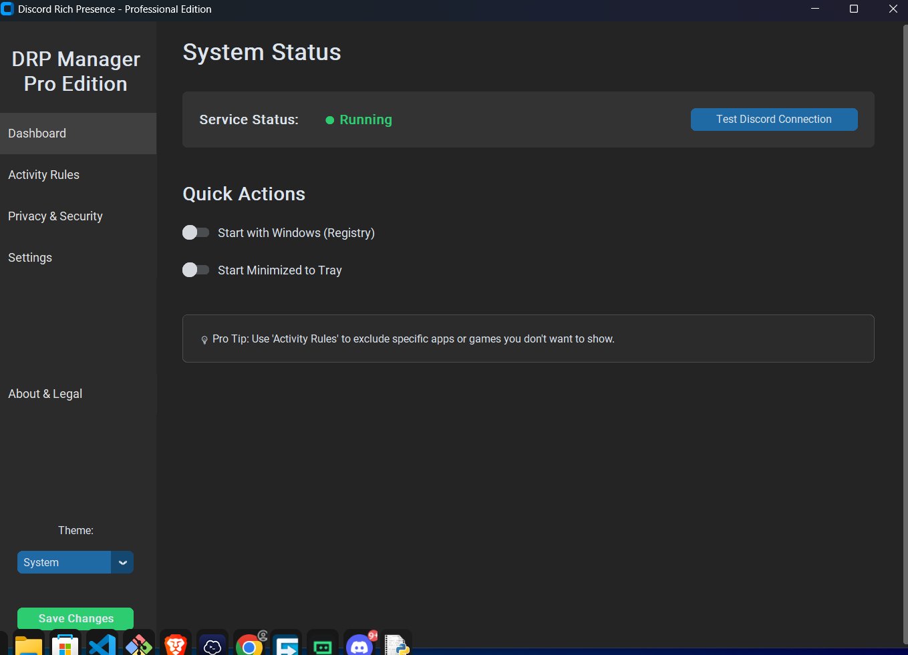
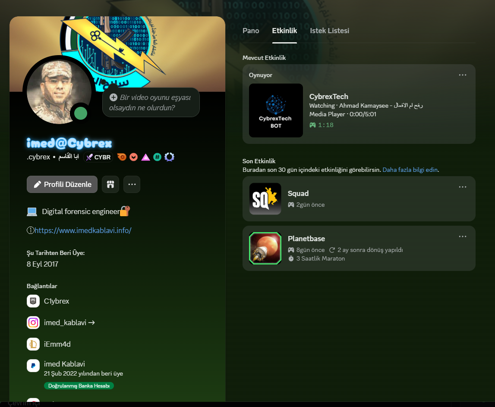

# Discord Rich Presence Service

[](https://github.com/imedkablavi/discord-rich-presence/actions/workflows/qa.yml)
[](https://www.python.org/)
[](https://github.com/imedkablavi/discord-rich-presence)
[](LICENSE)

A local Discord Rich Presence service for developers, media playback, browsers, terminals, games, and normal desktop applications.

The service watches the foreground application, converts it into a Discord activity, applies the configured privacy rules, and publishes it through Discord Desktop RPC. It does not depend on a project-operated cloud service.

## Screenshots

| Control Panel | Discord Activity |
| :---: | :---: |
|  |  |
| Control panel and service status | Rich Presence in Discord |

## What it detects

| Category | Examples |
| --- | --- |
| Coding | VS Code, VSCodium, Trae, JetBrains IDEs, Vim/Neovim, Sublime Text, Notepad++ |
| Browsers | Chrome, Firefox, Edge, Brave, Chromium, Opera, Vivaldi |
| Media | Spotify, VLC, MPV, browser media sessions, Windows media sessions |
| Terminal | Bash, Zsh, PowerShell, Windows Terminal, CMD and other supported terminals |
| Gaming | Known game processes with conservative matching to reduce false positives |
| Applications | Optional fallback for foreground apps that do not match a specialized detector |

Media activities use Discord listening/watching activity types where appropriate. Playing media uses Discord start/end timestamps so elapsed time continues to advance without repeatedly rewriting the RPC payload. Browser service links are inferred from visible window-title metadata; the service does not currently read the exact browser tab URL.

## Privacy

There are three privacy modes:

| Mode | Behavior |
| --- | --- |
| `off` | Publishes detected activity without project-side redaction. |
| `balanced` | Keeps useful context while redacting configured secret patterns and reducing path exposure. |
| `strict` | Uses generic descriptions and removes identifying browser URLs/buttons. |

The default is `balanced`.

Rich Presence is cleared when activity disappears or becomes blocked. It can also be cleared when a known lock-screen window is detected. Terminal tracking uses local per-shell cache files and tries to match the focused terminal process tree before publishing a command. In Balanced mode, values following sensitive command flags such as token/password arguments are redacted. Inferred browser links are removed when their source title contains data that required redaction.

For the exact data paths and behavior, see [docs/PRIVACY.md](docs/PRIVACY.md).

## Windows

### Packaged releases

Tagged releases are built as `DiscordRichPresence.exe` and published with a SHA-256 checksum. The executable contains the service, tray controls, and control panel in one build.

[Open Releases](https://github.com/imedkablavi/discord-rich-presence/releases)

If no tagged release has been published yet, use the source setup below.

### Run from source

Requirements:

- Python 3.10 or newer
- Discord Desktop

```bat
git clone https://github.com/imedkablavi/discord-rich-presence.git
cd discord-rich-presence
run.bat
```

`run.bat` creates the virtual environment when needed, repairs an outdated environment, verifies the required runtime packages, and starts the service in the system tray.

## Linux

Requirements:

- Python 3.10 or newer
- Discord Desktop
- X11: `xprop` for foreground-window detection
- KDE Plasma Wayland: `kdotool`
- Sway: `swaymsg`
- Media: `playerctl` is recommended for MPRIS detection; pydbus/PyGObject remains a fallback

```bash
git clone https://github.com/imedkablavi/discord-rich-presence.git
cd discord-rich-presence
python3 -m venv .venv
. .venv/bin/activate
pip install -r requirements.txt
python main.py
```

KDE Plasma Wayland is supported through `kdotool`, and Sway is supported through `swaymsg`. Other Wayland compositors may not expose a reliable foreground-window API, so the service returns no foreground activity instead of guessing from unrelated running processes.

## Configuration

Configuration is stored at:

- Windows: `%APPDATA%\discord-rich-presence\config.yaml`
- Linux: `~/.config/discord-rich-presence/config.yaml`

The full example is in [config.example.yaml](config.example.yaml).

```yaml
discord:
  client_id: "1437867564762923028"
  buttons: []

privacy:
  mode: balanced
  hide_home_paths: true

update_interval_secs: 2

rules:
  clear_on_lock_screen: true
  terminal_command_ttl_secs: 21600
  enabled_detectors:
    media: true
    terminal: true
    coding: true
    browser: true
    gaming: true
    application: true
```

`update_interval_secs` controls how often local activity is checked, not how often Discord is updated. The service only sends a new RPC payload when the resulting activity changes. The default is 2 seconds; values down to 1 second are accepted when faster switching is preferred.

Set `application: false` if you only want recognized activity categories and do not want generic foreground-window titles published.

The config loader validates Client IDs, button limits, URLs, privacy regexes, detector settings, party sizes, and other values before saving or applying them.

## Control panel

The control panel can start and stop the service, edit common settings, test Discord RPC, change privacy mode, open logs, and show the state of a service started by the GUI, tray, `run.bat`, or Windows startup.

The Dashboard reports the service PID, heartbeat, Discord RPC connection state, current activity summary, and recent runtime errors. A per-user runtime lock prevents multiple service instances from fighting over Discord RPC.

When the GUI stops the service, it requests a graceful shutdown first so Rich Presence can be cleared and the RPC connection can be closed normally.

## Terminal command tracking

Terminal command tracking is optional. Install only the hook for shells where you want command activity published.

### Bash

Add this to `~/.bashrc`:

```bash
source /path/to/discord-rich-presence/scripts/hooks/bash.sh
```

### Zsh

Add this to `~/.zshrc`:

```zsh
source /path/to/discord-rich-presence/scripts/hooks/zsh.zsh
```

### PowerShell

Add this to `$PROFILE`:

```powershell
. "C:\path\to\discord-rich-presence\scripts\hooks\powershell.ps1"
```

Restart the shell after adding the hook. The supplied hooks write local PID-scoped cache files. The Bash hook composes with an existing `PROMPT_COMMAND` instead of replacing a user's DEBUG trap, and the PowerShell hook preserves an existing PSReadLine history handler.

## Command line

```text
python main.py [--config PATH] [--privacy off|balanced|strict]
               [--dry-run] [--once] [--verbose] [--tray]
```

Useful diagnostics:

```bash
python main.py --dry-run --once --verbose
```

This performs one detection cycle and logs the payload without publishing it to Discord.

## Logs and runtime files

Logs:

- Windows: `%LOCALAPPDATA%\discord-rich-presence\logs\app.log`
- Linux: `~/.local/state/discord-rich-presence/app.log`

Runtime state:

- Windows: `%LOCALAPPDATA%\discord-rich-presence\runtime\`
- Linux: `~/.local/state/discord-rich-presence/runtime/`

Logs rotate automatically. See [docs/TROUBLESHOOTING.md](docs/TROUBLESHOOTING.md) when a detector or Discord connection is not behaving as expected.

## Building the Windows executable

```powershell
python -m pip install -r requirements-dev.txt
pyinstaller --clean --noconfirm discord-rich-presence.spec
```

The output is:

```text
dist/DiscordRichPresence.exe
```

The QA workflow also builds the Windows executable on pull requests so packaging failures are caught before release. Tags matching `v*` use the release workflow to publish the executable and SHA-256 checksum.

## Development

```bash
python -m pip install -r requirements-dev.txt
python -m compileall -q .
ruff check . --select E9,F63,F7,F82
pytest -q
```

CI runs on Windows and Ubuntu with Python 3.10 and 3.12. Linux CI also syntax-checks the Bash and Zsh hooks.

See [CONTRIBUTING.md](CONTRIBUTING.md) before opening a pull request. Security reports should follow [SECURITY.md](SECURITY.md).

## Current limitations

- Exact browser URLs are not available without a browser extension or native browser integration.
- Wayland foreground-window support currently covers KDE Plasma through `kdotool` and Sway through `swaymsg`; other compositors may need a dedicated implementation.
- Game detection intentionally avoids broad guesses, so unknown games may fall back to normal application activity.
- Lock-screen detection uses known lock applications/window markers and may need updates for new desktop environments.
- macOS foreground-window detection is not implemented yet.
- Published Windows binaries are not code-signed yet. Releases include a SHA-256 checksum for integrity verification.

## License

Released under the MIT License. See [LICENSE](LICENSE).

---

<div align="center">
  <strong>Built with ❤️ by CYBREX@TECH</strong><br>
  Check out my other projects at <a href="https://imedkablavi.info">imedkablavi.info</a>
</div>
